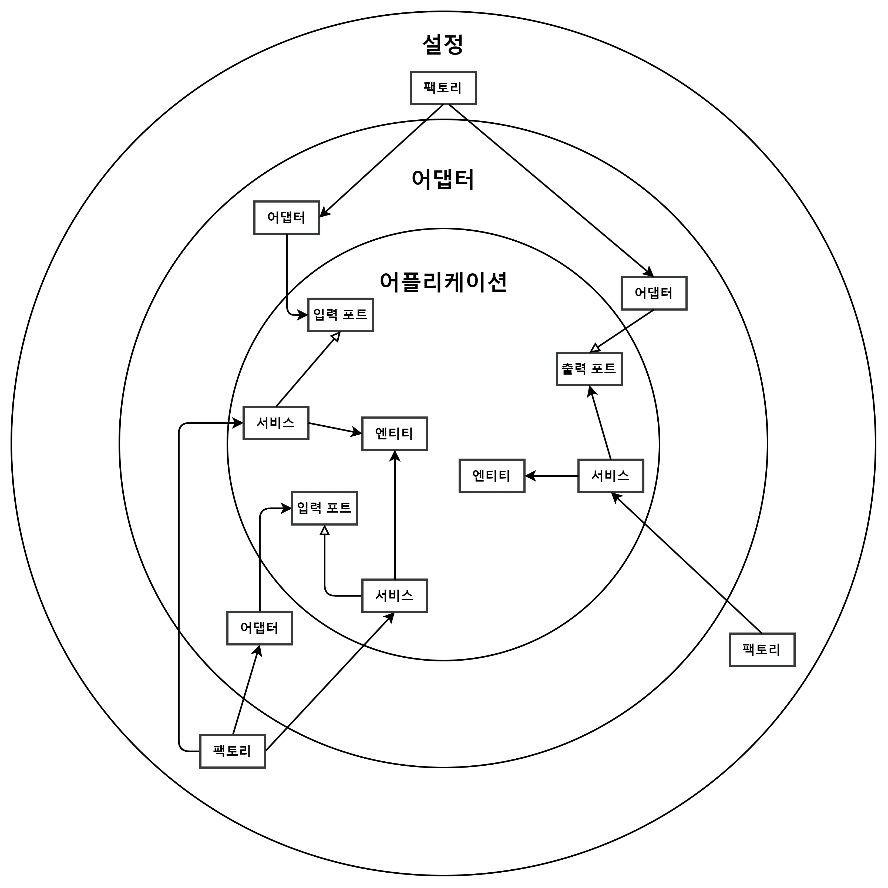
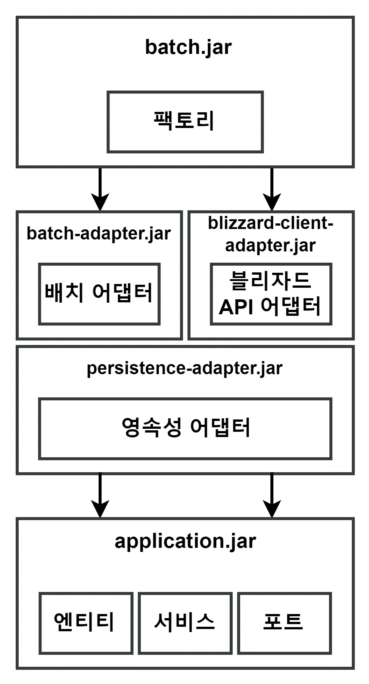
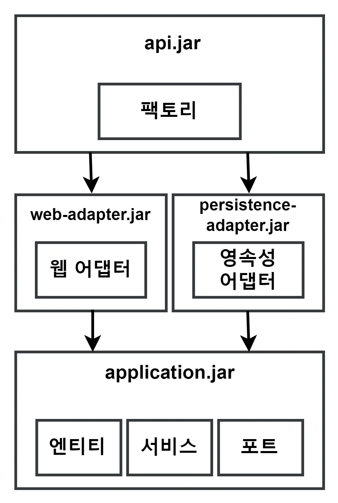
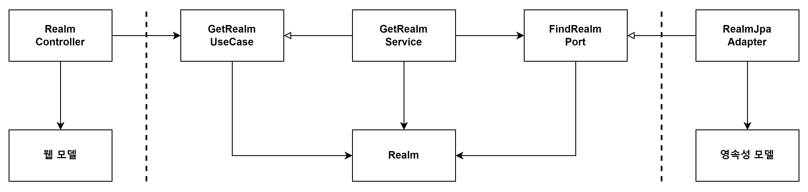
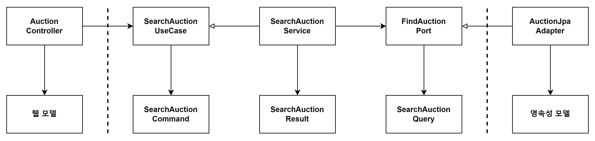
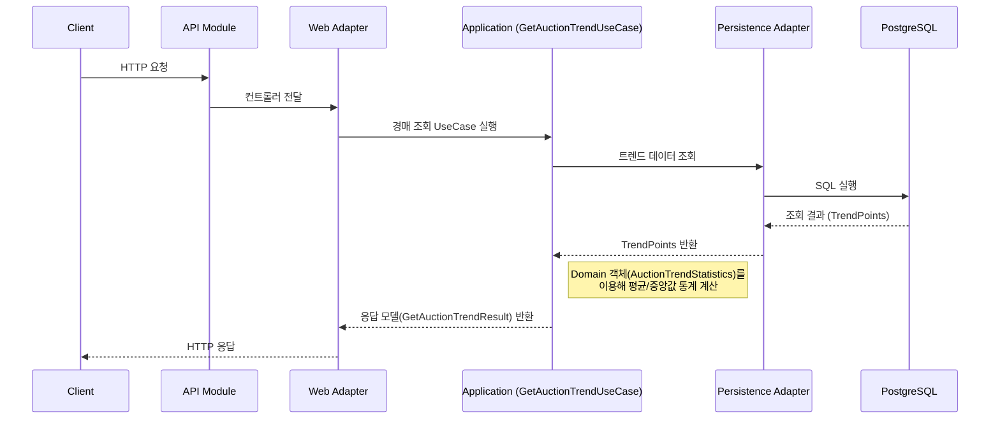
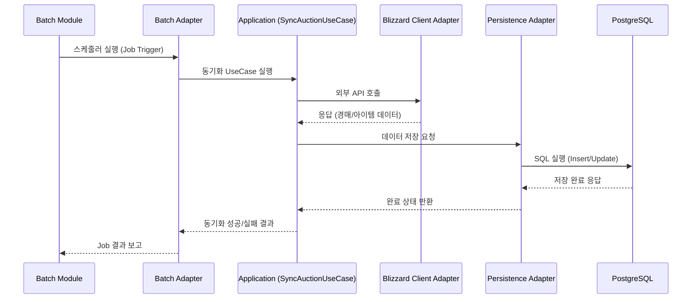
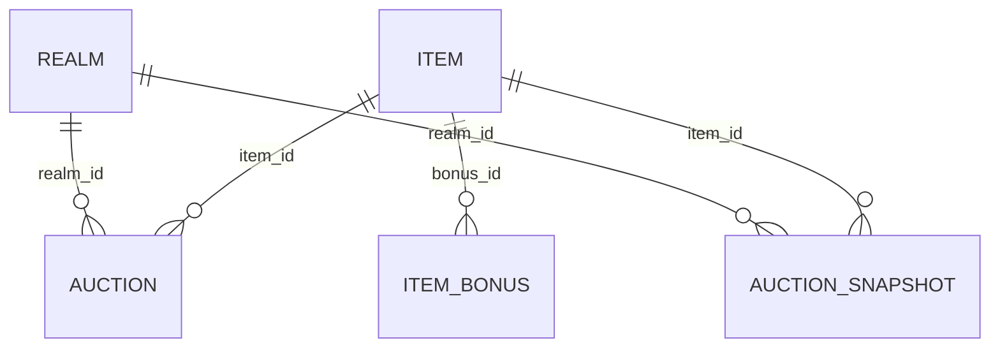

# Worbes

월드 오브 워크래프트 경매장 데이터를 수집/분석하는 프로젝트입니다. Blizzard API를 통해 경매 데이터를 동기화하고, 사용자에게 검색/분석 기능을 제공합니다.

## TOC

- [Impact](#impact)
- [Demo](#demo)
- [Problem–Solution–Result](#problemsolutionresult)
- [Architecture](#architecture)
    - [Overview](#overview)
    - [Layered Design](#layered-design)
    - [Module Structure](#module-structure)
    - [Mapping Strategy](#mapping-strategy)
    - [Data Flow](#data-flow)
- [API Examples](#api-examples)
- [Observability / Operations](#observability--operations)
- [Tests](#tests)
- [Tech Stack & Rationale](#tech-stack--rationale)
- [API Spec](#api-spec)
- [Versions](#versions)
    - [Numbering](#numbering)
    - [Major releases](#major-releases)
- [Roadmap](#roadmap)

## Impact

- 일일 동기화 규모: 1.0M 레코드/일(최근 7일 평균)
- 배치 안정성: 실패율 0.3%(최근 14일)
- 데이터 범위: KR 18개 Realm, 14일 이력

## Problem–Solution–Result

1) 실시간 조회 vs 이력 분석 충돌

- 문제: 최신 조회 성능과 장기 이력 분석 요구가 상충
- 해결: 실시간 `auction` / 이력 `auction_snapshot` 테이블 분리, 복합 인덱스 최적화

2) 외부 API 토큰 만료/실패 처리

- 문제: Blizzard 토큰 만료/레이트리밋으로 간헐 실패
- 해결: 토큰 캐시+자동 갱신, 지수 백오프 리트라이, 실패 시 안전한 재시도 전략

3) 대량 적재와 읽기 분리

- 문제: 대량 적재 시 읽기 지연 증가
- 해결: 배치 청크/커밋 간격 튜닝, 인덱스 설계, JPA+MyBatis 선택적 사용

## Versions

Worbes는 GitHub Releases를 통해 버전을 관리하며, 현재 사이트의 버전은 Releases 페이지에서 확인할 수 있습니다.

### Numbering

- SemVer(major.minor.patch) 기반
    - **Major**: 기능 구조 변경, 아키텍처 변경, 대규모 리팩터링
    - **Minor**: 신규 기능 추가, 뉴스/콘텐츠 관련 주요 업데이트
    - **Patch**: 버그 수정, 문서/데이터 업데이트, 작은 기능 추가

### Major releases

- **v1.0 – 초기 런칭**
    - WoW 경매장 데이터 수집/검색/분석 기능 기본 구현
    - Application-Adapter 분리, Gradle 멀티 모듈 구조 적용

## Roadmap

향후 Worbes에 추가될 기능 및 개선 사항입니다. 순서나 일정은 유동적이며, 완료 시 업데이트됩니다.

### Content

- 경매 데이터 기록 기간 확장 (7일 → 30일)
- 아이템 가격 변동 기록 차트 제공
- 사용자 맞춤 알림/즐겨찾기 기능

### Features

- **경매장 데이터 조회**
    - 월드 오브 워크래프트 각 서버(Realm)의 Auction House 데이터를 확인할 수 있음.
    - 아이템별 현재 가격, 최저가, 평균가 등을 제공.
- **서버(Realm) 선택**
    - 내가 플레이하는 서버를 선택해서 그 서버의 경매장 정보만 볼 수 있음.
- **아이템 검색**
    - 원하는 아이템 이름으로 검색해서 가격 변동, 현재 시세 확인 가능.
- **기본 필터 제공**
    - 아이템 등급(희귀, 전설 등), 아이템 레벨, 확장팩 기준으로 검색 결과 좁히기 가능.

### Technical

- Spring Batch 기반 데이터 동기화 마이그레이션 완료
- Blizzard API 클라이언트 개선 및 캐싱 최적화
- CI/CD 자동 배포(GitHub Actions)
- 테스트 커버리지 향상 및 TDD 지속
- 코드 리팩터링 및 모듈 의존성 개선

## Architecture

### Overview

- Clean Architecture / Hexagonal Architecture 기반
- Application(비즈니스 로직)과 Adapter(외부 연동)를 엄격히 분리
- Gradle 멀티 모듈 구조로 **의존성 방향을 강제**

### Layered Design

- **Application**: 도메인 모델, 유즈케이스, 포트(in/out)
- **Adapter**: Web Controller, Persistence(JPA, Mybatis), 외부 API Client, Batch Job
- **Bootstrap(Config)**: 실행 환경(API, Batch)

### Module Structure

 

- `application.jar` → 순수 도메인 + 유즈케이스
- `adapter-*` → 기술 스택(JPA, Web, API 연동)
- `api.jar`, `batch.jar` → 실행 진입점

- → **기술 스택 교체에도 application 모듈 수정 최소화**

### Mapping Strategy

본 프로젝트에서는 상황에 따라 두 가지 매핑 전략을 혼합 적용했습니다.

1. **양방향 매핑 (Boundary Mapping)**

- Web, Persistence 등 외부 경계에서만 변환 수행.
- Application 내부는 순수 도메인 모델(`Realm`, `Auction` 등)만 다룸.
- 장점: 단순하고 성능 손실이 적으며, 도메인 중심 구조를 유지할 수 있음.
- 적용 사례: Realm, Item 등 기본 CRUD 흐름.

2. **완전 매핑 (Full Mapping)**

- 각 경계마다 별도의 모델(`Command`, `Result`, `Query`)을 정의하여 표현을 엄격히 분리.
- UseCase와 Service, Port 간 계약을 명확히 하여 확장성과 테스트 용이성을 강화.
- 적용 사례: `SearchAuctionUseCase`, `GetAuctionTrendUseCase` 등 복잡한 조회/분석 로직.
- 이유: 검색 조건·결과 포맷이 자주 확장될 수 있어, 도메인 모델과 분리된 표현 계층이 필요.

### Data Flow

1. **경매 조회 유즈케이스**

클라이언트가 API를 호출하면 Web Adapter가 요청을 받아 UseCase에 전달합니다.
UseCase는 Persistence Adapter를 통해 DB에서 트렌드 데이터를 조회하고, 도메인 객체(AuctionTrendStatistics)로 평균/중앙값 등 통계를 계산합니다.
최종적으로 GetAuctionTrendResult 응답 모델로 변환되어 클라이언트에 반환됩니다.

2. **경매 배치 저장 유즈케이스**

스케줄러에 의해 Batch Module이 실행되면, Batch Adapter를 통해 SyncAuctionUseCase가 호출됩니다.
UseCase는 Blizzard Client Adapter를 사용해 외부 Blizzard API에서 최신 경매 데이터를 가져오고, 이를 Persistence Adapter를 통해 DB에 저장합니다.
저장 완료 후 결과가 상위 모듈로 전달되어 동기화 Job의 성공/실패 여부를 보고합니다.

## DB

### 설계 핵심 요약

- 경매 데이터는 **분 단위로 변동**되며, 과거 기록도 중요하다.
- 따라서 `auction`은 **실시간 데이터 전용**, `auction_snapshot`은 **시세 이력 관리 전용**으로 분리.
- 아이템 이름/보너스는 구조가 유동적이므로 **JSONB로 유연성 확보**, 가격/수량은 **제약조건으로 무결성 보장**.
- 가장 많이 발생하는 쿼리(특정 서버의 특정 아이템 최신가 조회)에 맞춰 **인덱스를 최적화**.
- Trade-off: 정규화를 통해 무결성을 강화하는 대신, 일부 필드는 JSONB로 저장하여 **확장성과 다국어 지원**을 선택.

### 테이블 요약

| 테이블                    | 용도           | 설계 의도                                                                                    |
|------------------------|--------------|------------------------------------------------------------------------------------------|
| **`auction`**          | 실시간 경매 데이터   | 최신 데이터만 저장하여 빠른 조회 보장. `(region, realm_id, item_id)` 인덱스로 검색 최적화, CHECK 제약조건으로 잘못된 값 방지. |
| **`auction_snapshot`** | 경매 데이터 이력    | 과거 데이터는 분리 저장하여 성능 저하 방지. `(region, realm_id, item_id, time desc)` 인덱스로 최신 시세 분석 최적화.    |
| **`item`**             | 아이템 메타데이터    | 이름은 다국어 지원을 위해 JSONB로 저장. 클래스/서브클래스는 정형 스키마로 유지하여 조회 효율성 확보.                             |
| **`item_bonus`**       | 아이템 보너스 속성   | 수천 개의 보너스 ID와 가변적 구조를 별도 테이블로 분리. `auction_snapshot`와 조인하여 확장 가능.                        |
| **`realm`**            | 서버(Realm) 정보 | 동일 서버명이 지역마다 중복될 수 있어 `(region, slug)` 유니크 제약조건으로 전역 충돌 방지.                              |

### 설계 과정에서 고려한 문제와 해결

1. 실시간성과 이력 관리의 분리

- **문제:** 경매 데이터는 시간 단위로 변해 실시간 조회와 과거 분석 모두 중요하다.
- **해결:** `auction`은 **현재 상태만 저장**, `auction_snapshot`은 **시간축 기록 전용**.
- **Trade-off:** 파티셔닝을 고려했으나, 실시간성과 이력 데이터의 사용 패턴이 크게 달라 테이블 자체를 분리하는 것이 단순하고 효율적이라고 판단.

2. 유연성과 무결성의 균형

- **문제:** 아이템 이름은 다국어 지원이 필요하고, 보너스 속성은 가변적이다.
- **해결:** `name`은 JSONB로 저장하여 다국어 대응, `item_bonus`는 별도 테이블로 분리.
- **Trade-off:** 모든 속성을 정규화할 수도 있었으나, 새로운 언어/속성이 추가될 때 스키마 변경 비용이 크므로 **유연성을 우선**. 대신 가격·수량 같은 핵심 필드에는 CHECK 제약조건을 두어
  무결성을 유지.

3. 조회 성능 최적화

- **문제:** 가장 많이 발생하는 쿼리는 "특정 서버에서 특정 아이템의 최신 가격".
- **해결:** `(region, realm_id, item_id)` 인덱스로 실시간 검색 최적화.

  `auction_snapshot`은 `(region, realm_id, item_id, time desc)` 인덱스로 최신 이력 조회 최적화.

- **Trade-off:** 복합 인덱스 추가로 쓰기 비용이 늘어나지만, 조회 성능이 프로젝트의 핵심 가치라 판단하여 읽기 성능을 우선시.

4. 확장 가능성

- **문제:** 아이템 보너스 속성은 수천 개 이상 존재하고 구조가 가변적이다.
- **해결:** `item_bonus`를 별도 테이블로 관리하여 확장성 확보.
- **Trade-off:** 조인 비용은 증가하지만, 새로운 보너스 속성이 추가되더라도 스키마 변경이 불필요하다는 장점이 더 크다고 판단.

## API Spec

이 프로젝트는 경매장 데이터를 조회할 수 있는 REST API를 제공합니다.
자세한 스펙은 별도 문서에 정리되어 있습니다.

- [📄 API 명세서](./docs/api-spec.md)

## Tech Stack

- Spring Boot, Spring Batch, JPA, MyBatis, Flyway, PostgreSQL
- JPA vs MyBatis 사용 기준
    - JPA: 단순 CRUD, 엔티티 중심 트랜잭션, 캐시 이점 활용
    - MyBatis: 복잡 조회, 대량 처리/튜닝이 필요한 SQL, DB 특화 기능 활용

